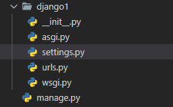

# Repositorio para os Meus Estudos em Django

## O que é Django?

Django é um framework da linguagem de programação Python. Ele tem como objetivo utilizar Python no back-end de aplicações WEB.

O Django é baseado em projetos e apps. Os apps Django são inseridos dentro dos projetos para funcionar. Um exemplo de app é um carrinho de compras e um exemplo de projeto é o e-commerce todo, que é formado por vários apps Django.

O Django usa um modelo projeto MTV:

- Model: Mapeamento do banco de dados para o projeto;
- Template: Páginas para visualização de dados. Normalmente, é aqui que fica o HTML que será renderizado nos navegadores;
- View: Lógica de negócio. É aqui que determinamos o que irá acontecer em nosso projeto. É equivalente ao controller do padrão MVC

Os comandos para inicializar um projeto e um app Django são:

`django-admin startproject nomeDoProjeto <caminho do projeto>`

`django-admin startapp nomeDoProjeto <caminho do app>`

Caso o caminho do projeto ou app não sejam definidos o django-admin vai criar o mesmo dentro do repositorio onde foi invocado.



Estrutura de um projeto Django


Estrutura de um app Django

Nas imagens acima podemos observar as estruturas de um projeto e um app Django respectivamente.

### `settings.py`

Existem muitos arquivos a serem explorados mas, vamos iniciar com o arquivo `settings.py` em especial, vamos observar a variável `DEBUG = True` .

O `DEBUG = True` significa dizer que os erros que ocorrerem vão ser impressos na tela. É muito importante mudar essa variável para `False` quando for colocar o projeto para produção.

### `views.py`

Quando o `DEBUG = False` o Django busca no arquivo `views.py` o conteúdo a ser exibido na pagina. Para ser mais especifico, ele procura uma função que retorne um arquivo `index.html`.

Uma função no arquivo `views.py` se parece com:

```python
def index(request):
		return render(request, ‘index.html’)
```

As views podem ser acessadas quando existem rotas que acessam elas via arquivo `urls.py` .